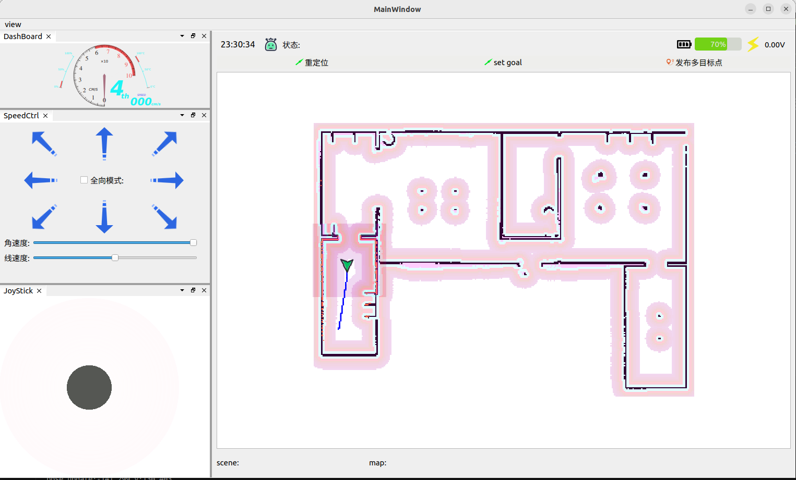
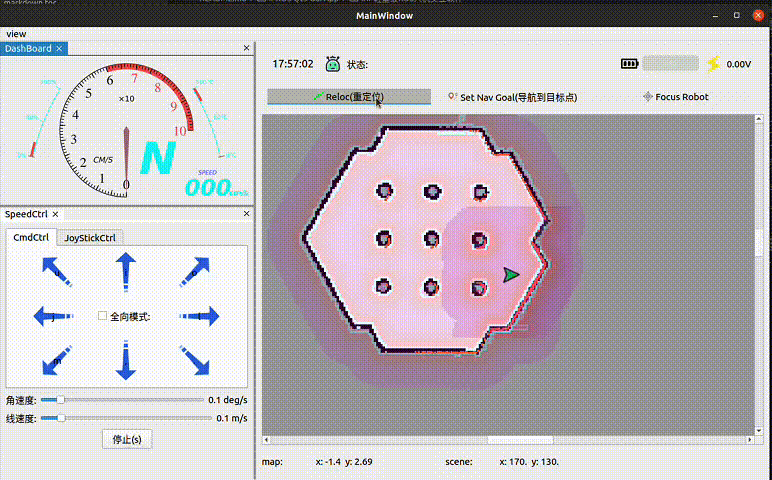
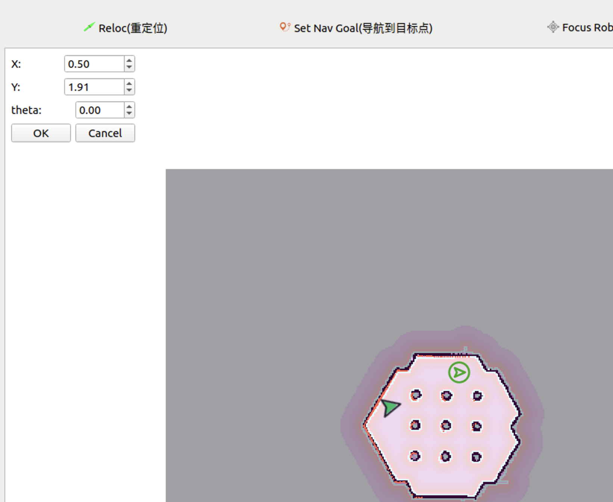
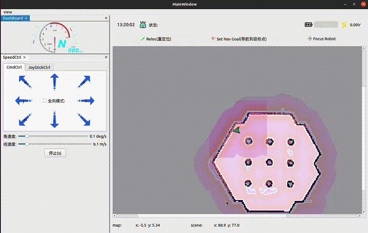
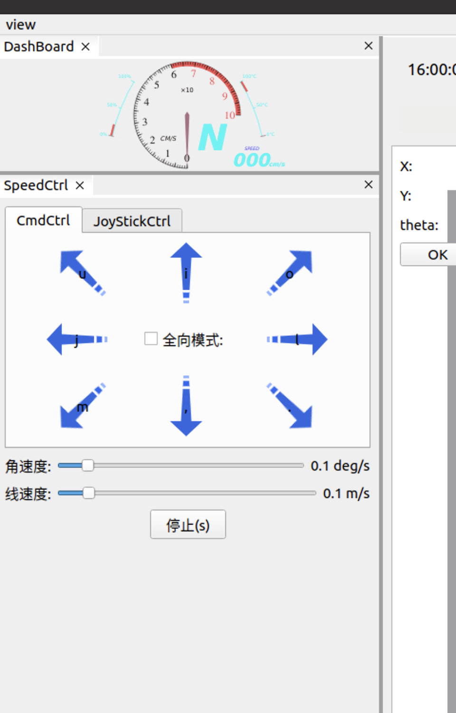
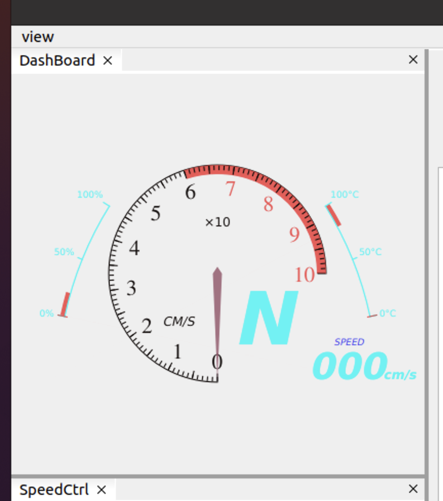

<!--
 * @Author: chengyangkj chengyangkj@qq.com
 * @Date: 2023-09-02 07:23:43
 * @LastEditors: chengyangkj chengyangkj@qq.com
 * @LastEditTime: 2023-10-06 14:03:03
 * @FilePath: /ROS2_Qt5_Gui_App/README.md
-->
简体中文 | [English](./README_en.md)
## 轻量级ROS1/ROS2移动机器人人机交互软件


<a href="http://qm.qq.com/cgi-bin/qm/qr?_wv=1027&k=mvzoO6tJQtu0ZQYa_itHW7JrT0i4OCdK&authKey=exOT53pUpRG85mwuSMstWKbLlnrme%2FEuJE0Rt%2Fw6ONNvfHqftoWMay03mk1Qi7yv&noverify=0&group_code=797497206">

</a>


<!-- 
<a href="https://www.bilibili.com/video/BV14h4y1w7TC">

</a>
<a href="https://www.bilibili.com/video/BV11h4y1y74H">

</a>
-->


本项目基于Qt5开发，基于CMake进行构建，可以实现一套代码同时在ROS1/ROS2系统中使用(本项目已接入CI,保证多ROS版本/系统版本可用性)

软件在编译时会自动识别环境变量中的ROS1/ROS2环境并进行构建，实现ROS通信与界面隔离

软件所有功能均为自行绘制实现,因此可以轻松运行在一些性能比较低的边缘设备

功能/TODO:
  
| 功能                        | 状态 | 备注 |
| --------------------------- | ---- | ---- |
| ROS1/ROS2通信               | ✅    |      |
| 全局/局部地图显示           | ✅    |      |
| 机器人实时位置显示          | ✅    |      |
| 机器人速度仪表盘            | ✅    |      |
| 机器人手动控制              | ✅    |      |
| 机器人重定位                | ✅    |      |
| 机器人单点/多点导航         | ✅    |      |
| 机器人全局/局部规划轨迹显示 | ✅    |      |
| 机器人拓扑地图功能          | ✅    |      |
| 电池电量显示                | ✅    |      |
| 地图编辑功能                | ✍    |      |
| 机器人导航任务链            | ✍    |      |
| 基于protobuf的通信          | 🏷️    |      |
| 鹰眼视图                    | 🏷️    |      |
| 3D图层显示                  | 🏷️    |      |
| 相机图像显示                | 🏷️    |      |

大家如果有什么有意思的界面/功能性需求,可以提在[此处](https://github.com/chengyangkj/Ros_Qt5_Gui_App/issues/29),也欢迎大家发起Merge Request一起参与项目建设

此仓库国内加速镜像链接:[gitee](https://gitee.com/chengyangkj/Ros_Qt5_Gui_App)

  <picture>
    <source media="(prefers-color-scheme: dark)" srcset="https://api.star-history.com/svg?repos=chengyangkj/Ros_Qt5_Gui_App&type=Timeline&theme=dark" />
    <source media="(prefers-color-scheme: light)" srcset="https://api.star-history.com/svg?repos=chengyangkj/Ros_Qt5_Gui_App&type=Timeline" />
    
  </picture>

## 项目截图




<!-- TOC -->
## 目录

- [一,Release 版本下载使用](#一release-版本下载使用)
- [二,编译](#二编译)
  - [1,环境安装](#1环境安装)
  - [2,克隆/下载本项目:](#2克隆下载本项目)
  - [3,编译项目](#3编译项目)
  - [4,运行项目](#4运行项目)
- [三,使用说明](#三使用说明)
    - [3.1,多机通信配置](#31多机通信配置)
    - [3.2,配置文件](#32配置文件)
    - [3.3,重定位位姿态发布](#33重定位位姿态发布)
    - [3.4,导航目标点设置](#34导航目标点设置)
    - [3.5,手动控制机器人](#35手动控制机器人)
    - [3.6,速度仪表盘](#36速度仪表盘)
    - [3.7,电池电量显示](#37电池电量显示)
- [四,相关链接](#四相关链接)
- [五,相关教程及交流群](#五相关教程及交流群)

<!-- /TOC -->

# 一,Release 版本下载使用

使用Release版本的前提:系统ROS环境已安装,并且source到环境变量中

本仓库使用CI自动生成各平台的Release版本,在项目的[Release页面](https://github.com/chengyangkj/Ros_Qt5_Gui_App/releases)下载最新对应ROS版本的Release版本，理论上解压后即可使用。
使用方法:
在终端进入解压后的文件夹路径,执行如下命令:

```
sudo chmod a+x ./ros_qt5_gui_app
./ros_qt5_gui_app

```
如果Release版本下载后使用不了，可以参考[二,编译](#二编译)进行自行编译使用

# 二,编译


注意，为了保证此项目同时兼容ROS1与ROS2，此项目不使用ROS1/ROS2的catkin_make/colcon构建系统进行够建，而是使用标准CMake进行构建，这也就意味着，本项目不会被ROS自动识别为功能包
可以参考以下教程从0开始构建/运行此项目:

## 1,环境安装 

理论上只需要安装如下基础包就可以编译此项目:

```
sudo apt-get update
sudo apt-get install qtbase5-private-dev -y
```

如果以上安装后还不行，可以执行如下指令安装全部依赖:

```
sudo apt-get install qtbase5-dev qt5-qmake qtbase5-dev-tools qtbase5-private-dev libeigen3-dev libgtest-dev -y

```

## 2,克隆/下载本项目:


```
mkdir -p ~/qt_ws
cd ~/qt_ws
git clone https://github.com/chengyangkj/Ros_Qt5_Gui_App
```

note:如果github下载过慢,可以使用以下指令从gitee拉取

```
git clone https://gitee.com/chengyangkj/Ros_Qt5_Gui_App

```

## 3,编译项目

可以手动执行如下命令进行编译(会根据环境变量自动识别ROS1还是ROS2环境):
```
cd ~/qt_ws/ROS2_Qt5_Gui_App
mkdir -p build
cd build
cmake ..
make

```
或者执行如下脚本手动指定ROS版本并进行一键编译:

```
cd ~/qt_ws/ROS2_Qt5_Gui_App

```
ROS1:

```
sh ./build_ros1.sh

```
ROS2

```
sh ./build_ros2.sh
```
## 4,运行项目

```
cd ~/qt_ws/ROS2_Qt5_Gui_App/build
./ros_qt5_gui_app

```

软件配置文件路径(运行一次软件后会自动生成在可执行程序相对路径下):

```

~/qt_ws/ROS2_Qt5_Gui_App/build/config.json

```

# 三,使用说明

### 3.1,多机通信配置

针对于ROS新手的温馨提示:此项配置,如果是单机使用即本软件运行在机器人身上,没有跨机器使用就不用配置，直接跳过即可.如果需要将本软件运行在自己的笔记本上,去连接远程的机器人的情况下需要进行配置

ROS1/ROS2的多机通信完全依赖ROS原生(环境变量添加ROS_MASTER_URI与ROS_IP/ROS_DOMAINID),不再由用户手动指定,减轻新手使用负担

ROS1:

配置参考：多机通讯教程[csdn 博客](https://blog.csdn.net/qq_38441692/article/details/98205852)

ROS2:

环境变量多机配置相同的ROS_DOMAINID

### 3.2,配置文件

第一次运行后，会在可执行程序同级目录生成config.json,修改此配置文件即可(需要注意Json格式),修改后重启生效,具体配置说明详见[配置文件说明](./doc/config.md)


### 3.3,重定位位姿态发布

程序可以拖动式的设置机器人初始位置（重定位）,相对于Rviz,拖动时可以实时查看激光匹配情况,重定位更加精准




注意:如果设置无效,需要检查config.json中设置：

```
{
      "display_name": "Reloc",
      "topic": "/initialpose",
      "enable": true
}
```
为自己机器人监听的重定位Topic名称


### 3.4,导航目标点设置

程序可以拖动式的设置机器人导航目标点（导航）使用图文说明如下:






注意:如果设置无效,需要检查config.json中设置：

```
{
      "display_name": "NavGoal",
      "topic": "/move_base_simple/goal",
      "enable": true
}
```
为自己机器人监听的导航目标点Topic名称


### 3.5,手动控制机器人

软件支持发布实时速度到底盘:



对应按钮上的文字，可以由键盘对应按钮同步调用

注意:如果设置无效,需要检查config.json中设置：

```
{
      "display_name": "Speed",
      "topic": "/cmd_vel",
      "enable": true
}

```
为实际机器人监听的速度控制话题

### 3.6,速度仪表盘

软件支持实时显示机器人速度:



注意:如果设置无效,需要检查config.json中设置：

```
{
      "display_name": "Odometry",
      "topic": "/odom",
      "enable": true
}
```

为机器人时机发布的里程计话题

### 3.7,电池电量显示

软件支持实时显示机器人电量,在配置中配置话题名，电池电量的Topic类型为:sensor_msgs::BatteryState

```
{
      "display_name": "Battery",
      "topic": "/battery",
      "enable": true
}
```


# 四,相关链接


| 友链名                                                                             | 支持平台                  | 功能                                                                                                   |
| ---------------------------------------------------------------------------------- | ------------------------- | ------------------------------------------------------------------------------------------------------ |
| [master](https://github.com/chengyangkj/Ros_Qt5_Gui_App/tree/master)               | Win10 Ubuntu              | ROS + QWidget + QGraphicsview自绘制可视化界面显示                                                      |
| [qml_hmi](https://github.com/chengyangkj/Ros_Qt5_Gui_App/tree/qml_hmi)             | Win10 Ubuntu              | ROS + QML + C++混合编程，qml自绘制地图，激光雷达可视化显示等demo                                       |
| [simple](https://github.com/chengyangkj/Ros_Qt5_Gui_App/tree/simple)               | Win10 Ubuntu              | ROS + QWidget + Librviz进行可视化显示，为《ROS人机交互软件开发》系列课程中实现的版本，CSDN博客例程版本 |
| [rviz_tree](https://github.com/chengyangkj/Ros_Qt5_Gui_App/tree/rviz_tree)         | Win10 Ubuntu              | ROS + QWidget + Librviz原生图层Api实现图层管理，不需手动创建图层                                       |
| [ros_qt_demo](https://github.com/chengyangkj/Ros_Qt5_Gui_App/tree/ros_qt_demo)     | Win10 Ubuntu              | cakin_create_qt_pkg 创建的原始包，cmakelist.txt已配置好改为qt5，可以直接编译运行                       |
| [ros2_qt_demo](https://github.com/chengyangkj/ros2_qt_demo)                        | ROS2                      | 在ROS2平台上运行的qt demo包，cmakelist.txt已配置好改为qt5，可以直接colcon build 编译使用               |
| [ROS2_Qt5_Gui_App](https://github.com/chengyangkj/ROS2_Qt5_Gui_App)                | ROS2                      | 与本仓库代码完全相同/停止维护                                                                          |
| [Flutter App](https://github.com/chengyangkj/Ros_Qt5_Gui_App/tree/ros_flutter_app) | 基于flutter实现多平台运行 | 逐步推进.....                                                                                          |


# 五,相关教程及交流群

 **本系列教程文章专栏:**

[ROS机器人GUI程序开发](https://blog.csdn.net/qq_38441692/category_9863968.html)

 **本系列课程已上线古月学院，欢迎感兴趣的小伙伴订阅：**

 1. [ROS Qt开发环境搭建以及基础知识介绍](https://class.guyuehome.com/detail/p_5eba414d58533_Uh4XTbPi/6)
 2. [ROS人机交互软件的界面开发](https://class.guyuehome.com/detail/p_5ec490a8d7bd7_b7ucPqUs/6)
 3. [ROS Rviz组件开发方法](https://class.guyuehome.com/detail/p_5edf2d27a1942_foy4nqci/6)
 4. [如何实现ROS windows人机交互软件](https://class.guyuehome.com/detail/p_5fc5ab97e4b04db7c091f475/6)
 


**开发交流QQ群：** 797497206
