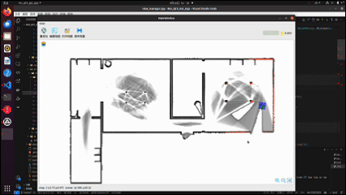
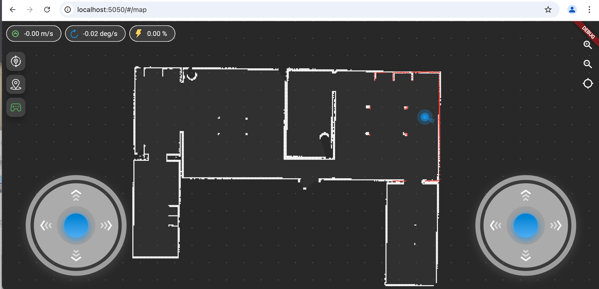

<!--
 * @Author: chengyangkj chengyangkj@qq.com
 * @Date: 2023-09-02 07:23:43
 * @LastEditors: chengyangkj chengyangkj@qq.com
 * @LastEditTime: 2023-10-06 14:03:03
 * @FilePath: /ROS2_Qt5_Gui_App/README.md
-->
<div align="center">

# ROS Qt5 GUI App

*一个轻量级的 ROS1/ROS2 移动机器人人机交互软件*

[简体中文](./README.md) | [English](./README_en.md)

[](https://github.com/chengyangkj/Ros_Qt5_Gui_App/commits/master)
[](https://github.com/chengyangkj/Ros_Qt5_Gui_App/stargazers)
[](https://github.com/chengyangkj/Ros_Qt5_Gui_App/network/members)
[](https://github.com/chengyangkj/Ros_Qt5_Gui_App/issues)
[](http://qm.qq.com/cgi-bin/qm/qr?_wv=1027&k=mvzoO6tJQtu0ZQYa_itHW7JrT0i4OCdK&authKey=exOT53pUpRG85mwuSMstWKbLlnrme%2FEuJE0Rt%2Fw6ONNvfHqftoWMay03mk1Qi7yv&noverify=0&group_code=797497206)


</div>

## 📖 简介

本项目基于 Qt5 开发，使用 CMake 构建，可以实现一套代码同时在 ROS1/ROS2 系统中使用。软件在编译时会自动识别环境变量中的 ROS1/ROS2 环境并进行构建，实现 ROS 通信与界面隔离。

所有功能均为自行绘制实现，因此可以轻松运行在性能较低的边缘设备上。项目已接入 CI，保证多 ROS 版本/系统版本的可用性。

### ✨ 功能特性

| 功能 | 状态 | 备注 |
|------|------|------|
| ROS1通信支持 |  ✅| 缺乏测试，bug请反馈[Issues](https://github.com/chengyangkj/Ros_Qt5_Gui_App/issues) |
| ROS2通信支持 | ✅ | 稳定及长期支持维护 |
| rosbridge 通信支持 | ✅ | [dev]开发中，部分功能已支持.. |
| 全局/局部地图显示 | ✅ | |
| 机器人实时位置显示 | ✅ | |
| 机器人速度仪表盘 | ✅ | |
| 机器人手动控制 | ✅ | |
| 机器人重定位 | ✅ | |
| 机器人单点/多点导航 | ✅ | |
| 机器人全局/局部规划轨迹显示 | ✅ | |
| 拓扑点位编辑功能 | ✅ | |
| 电池电量显示 | ✅ | |
| 地图障碍物编辑功能 | ✅ | |
| 拓扑路径编辑功能 | ✅ ||
| 地图加载/保存 | ✅ | |
| 相机图像显示 | ✅ | 移植自 rqt_image_view |
| 机器人车身轮廓显示 | ✅ | 订阅ros footprint话题 |

### 🖼️ 界面预览




## 🚀 快速开始

### 环境要求

- Ubuntu 18.04+
- ROS1/ROS2 环境
- Qt5 基础环境
- CMake 3.16+ 

### 安装依赖

```bash
sudo apt-get update
sudo apt-get install qtbase5-private-dev libqt5svg5-dev libsdl-image1.2-dev libsdl1.2-dev libbson-dev libwebsocketpp-dev  -y
```

### CMake 升级

ubuntu 18.04 默认安装的是 3.10.2 版本，需要升级到 3.16+ 版本, Ubuntu20.04及以上可跳过此步骤

```bash
wget https://cmake.org/files/v3.16/cmake-3.16.4-Linux-x86_64.sh -O cmake-install.sh
chmod +x cmake-install.sh
sudo ./cmake-install.sh --prefix=/usr/local --skip-license
```

### 编译构建

```bash
mkdir -p ~/qt_ws
cd ~/qt_ws
git clone https://github.com/chengyangkj/Ros_Qt5_Gui_App
cd Ros_Qt5_Gui_App
mkdir build && cd build
cmake ..
make
```

### 运行

```bash
./ros_qt5_gui_app
```

## 📚 文档

- [配置说明](./doc/configuration.md)
- [使用指南](./doc/usage.md)
- [开发指南](./doc/development.md)
- [常见问题](./doc/faq.md)


## 🤝 贡献

欢迎提交 [Issues](https://github.com/chengyangkj/Ros_Qt5_Gui_App/issues) 和 [Pull Requests](https://github.com/chengyangkj/Ros_Qt5_Gui_App/pulls)。

如果有什么想法或者建议，欢迎提交 [🌟心愿/需求单](https://github.com/chengyangkj/Ros_Qt5_Gui_App/issues/29) 说不定哪天就实现了呢

## 📊 Star 历史

<div align="center">
  <picture>
    <source media="(prefers-color-scheme: dark)" srcset="https://api.star-history.com/svg?repos=chengyangkj/Ros_Qt5_Gui_App&type=Timeline&theme=dark" />
    <source media="(prefers-color-scheme: light)" srcset="https://api.star-history.com/svg?repos=chengyangkj/Ros_Qt5_Gui_App&type=Timeline" />
    
  </picture>
</div>

## 📱 相关项目

基于 Flutter 的 ROS1/ROS2 跨平台移动机器人人机交互软件已正式开源：



详情请访问 [ROS_Flutter_Gui_App](https://github.com/chengyangkj/ROS_Flutter_Gui_App)

## 🔗 相关链接

| 分支 | 支持平台 | 功能说明 |
|------|---------|---------|
| [master](https://github.com/chengyangkj/Ros_Qt5_Gui_App/tree/master) | Win10 Ubuntu | ROS + QWidget + QGraphicsview 自定义可视化界面显示 |
| [qml_hmi](https://github.com/chengyangkj/Ros_Qt5_Gui_App/tree/qml_hmi) | Win10 Ubuntu | ROS + QML + C++ 混合编程，QML 自绘制地图、激光雷达等可视化 demo |
| [simple](https://github.com/chengyangkj/Ros_Qt5_Gui_App/tree/simple) | Win10 Ubuntu | ROS + QWidget + Librviz 可视化显示，CSDN 博客《ROS 人机交互软件开发》课程实现版本 |
| [rviz_tree](https://github.com/chengyangkj/Ros_Qt5_Gui_App/tree/rviz_tree) | Win10 Ubuntu | ROS + QWidget + Librviz 原生图层 API 管理图层，无需手动创建图层 |
| [ros_qt_demo](https://github.com/chengyangkj/ros_qt_demo) | Win10 Ubuntu | 使用 cakin_create_qt_pkg 创建的原始包，cmakelist.txt 配置到 qt5，可直接编译运行 |
| [ros2_qt_demo](https://github.com/chengyangkj/ros2_qt_demo) | ROS2 | 运行在 ROS2 平台的 Qt demo 包，cmakelist.txt 配置到 qt5，可使用 colcon build 编译使用 |
| [ROS2_Qt5_Gui_App](https://github.com/chengyangkj/ROS2_Qt5_Gui_App) | ROS2 | 与本仓库相同/不再维护 |
| [Flutter App](https://github.com/chengyangkj/ROS_Flutter_Gui_App) | 多平台 (Flutter) | 已实现 |

## 💬 交流群

QQ 群: 797497206

## 📄 开源协议

本项目采用 [MIT](LICENSE) 开源协议。
