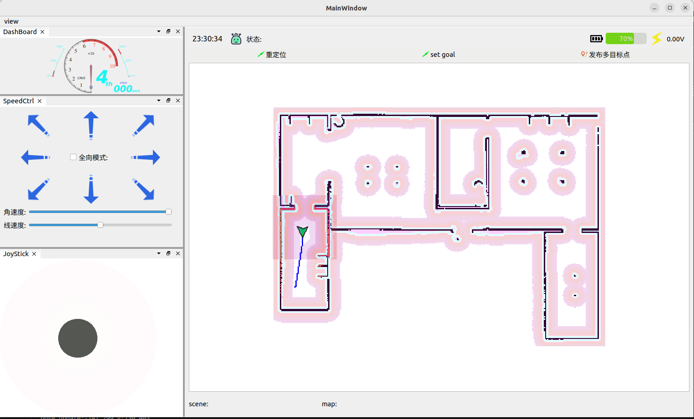
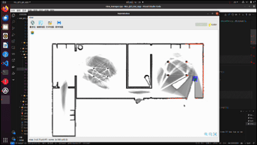
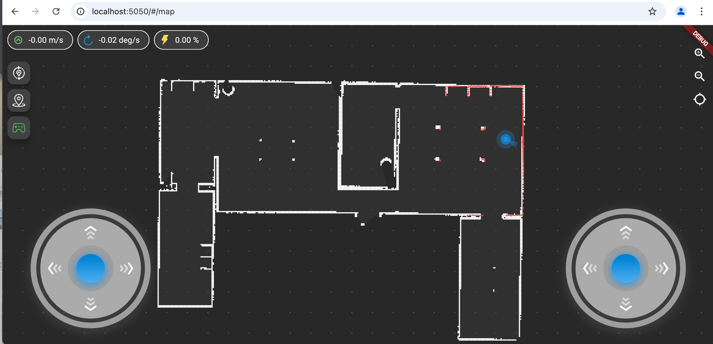

<!--
 * @Author: chengyangkj chengyangkj@qq.com
 * @Date: 2023-09-02 07:23:43
 * @LastEditors: chengyangkj chengyangkj@qq.com
 * @LastEditTime: 2024-01-15
 * @FilePath: /Ros_Qt5_Gui_App/README.md
-->
<div align="center">

# ROS Qt5 GUI App

*一个跨平台轻量级的 ROS1/ROS2 移动机器人人机交互软件*

[简体中文](./README.md) | [English](./README_en.md)

[](https://github.com/chengyangkj/Ros_Qt5_Gui_App/commits/master)
[](https://github.com/chengyangkj/Ros_Qt5_Gui_App/stargazers)
[](https://github.com/chengyangkj/Ros_Qt5_Gui_App/network/members)
[](https://github.com/chengyangkj/Ros_Qt5_Gui_App/issues)
[](http://qm.qq.com/cgi-bin/qm/qr?_wv=1027&k=mvzoO6tJQtu0ZQYa_itHW7JrT0i4OCdK&authKey=exOT53pUpRG85mwuSMstWKbLlnrme%2FEuJE0Rt%2Fw6ONNvfHqftoWMay03mk1Qi7yv&noverify=0&group_code=797497206)


</div>

## 📖 简介

本项目基于 Qt5 与 CMake 构建，采用统一代码基线同时支持 ROS1/ROS2。构建阶段会根据环境变量自动识别目标 ROS 运行时，实现通信层与界面层解耦，降低跨版本适配成本。

图形渲染基于 Qt Graphics View 体系实现，在保证交互能力的同时兼顾资源占用，适用于算力受限的边缘设备屏幕部署场景。项目已接入 CI 流水线，持续验证多 ROS 版本与多系统组合的可用性。当前已支持 Windows（通过 RosBridge 通信），可在项目 [Releases](https://github.com/chengyangkj/Ros_Qt5_Gui_App/releases) 页面获取可用版本。

### ✨ 功能特性

- ROS1 通信支持 - 基础功能已实现，持续优化中
- ROS2 通信支持 - 稳定及长期支持维护
- ROSBridge 通信支持 - 支持 WebSocket 连接，支持断线重连
- 全局/局部地图显示 - 支持 OccupancyGrid 地图
- 机器人实时位置显示 - 基于 TF 变换
- 机器人速度仪表盘 - 实时显示线速度和角速度
- 机器人手动控制 - 支持速度控制
- 机器人重定位 - 支持 2D Pose Estimate
- 机器人单点/多点导航 - 支持导航目标点设置
- 机器人全局/局部规划轨迹显示 - 实时显示规划路径
- 拓扑点位编辑功能 - 可视化编辑拓扑点
- 电池电量显示 - 订阅 BatteryState 话题
- 地图障碍物编辑功能 - 支持地图编辑
- 拓扑路径编辑功能 - 可视化编辑拓扑路径
- 地图加载/保存 - 支持地图文件管理
- 相机图像显示 - 支持多路图像显示
- 机器人车身轮廓显示 - 订阅 footprint 话题
- 激光雷达显示 - 支持 LaserScan 可视化

### 🖼️ 界面预览





## 🚀 快速开始

### 环境要求

- **操作系统**: Ubuntu 18.04+ / Windows 10+
- **ROS 环境**: ROS1 (Melodic/Noetic) 或 ROS2 (Foxy/Galactic/Humble)
- **Qt5**: Qt5.12+ (Qt5 Core, Widgets, SVG)
- **CMake**: 3.16+
- **编译器**: GCC 7+ / MSVC 2019+

## 📥 Release 二进制发行版使用

本仓库通过 CI 预编译了固定版本的二进制软件包。你可以在 [release](https://github.com/chengyangkj/Ros_Qt5_Gui_App/releases) 页面下载对应系统版本的压缩包并直接运行，当前提供以下两个版本：

- **Linux**: 下载 `.tar.gz` 压缩包，解压后参考 [Linux 方法 3: 安装后运行](#方法-3-安装后运行) 运行程序
- **Windows**: 下载 `.zip` 压缩包，解压后参考 [Windows 方法 3: 安装后运行](#方法-3-安装后运行-windows) 运行程序

### 配置说明

首次运行前，请确保：

1. **ROS 环境已配置**: 确保已 source ROS 的 setup.bash/setup.bat
2. **话题配置**: 检查配置界面中的话题名称是否与你的 ROS 系统匹配
3. **通道选择**: 在配置界面中选择正确的通信通道（ROS1/ROS2/ROSBridge）

详细配置说明请参考 [功能使用指南](./doc/usage.md)

## 🚀 编译与使用

如果想要进行二次开发或编译安装，参考如下教程

> **💡 提示：** 点击下方标签切换查看不同平台的编译与使用说明

<details open>
<summary><b>🐧 Linux 平台</b></summary>

### 安装依赖

```bash
sudo apt-get update
sudo apt-get install -y \
  qtbase5-dev \
  qtbase5-private-dev \
  libqt5svg5-dev \
  qtbase5-dev-tools \
  libeigen3-dev \
  libgtest-dev \
  libsdl2-dev \
  libsdl2-image-dev
```

### CMake 升级

Ubuntu 20.04及以下的系统自带的CMake版本过低，需要升级到 3.16+ 版本。Ubuntu 22.04 及以上可跳过此步骤。

```bash
wget https://cmake.org/files/v3.16/cmake-3.16.4-Linux-x86_64.sh -O cmake-install.sh
chmod +x cmake-install.sh
sudo ./cmake-install.sh --prefix=/usr/local --skip-license
```

### 编译构建

```bash
# 克隆仓库
git clone https://github.com/chengyangkj/Ros_Qt5_Gui_App.git
cd Ros_Qt5_Gui_App
```

#### 方法一、手动 CMake 编译

```bash
# 创建构建目录
mkdir build && cd build

# 配置和编译
cmake ..
make -j$(nproc)
```

#### 方法二、使用 build.sh 脚本

```bash
./build.sh
```

##### 使用 Gitee 镜像加速编译

将拉取的三方库位置替换为 Gitee 镜像，加速编译：

```bash
./build_cn.sh
```

或者手动指定镜像：

```bash
mkdir build && cd build
cmake .. \
  -DCMAKE_BUILD_TYPE=Release \
  -Ddockwidget_GIT_REPOSITORY=https://gitee.com/kqz2007/qt-advanced-docking-system_github.git \
  -Dnlohmann_json_GIT_REPOSITORY=https://gitee.com/athtan/json.git \
  -Dyaml-cpp_GIT_REPOSITORY=https://gitee.com/dragonet_220/yaml-cpp.git \
  -Dwebsocketpp_GIT_REPOSITORY=https://gitee.com/open-source-software_1/websocketpp.git
make -j$(nproc)
```

### 运行

#### 方法 1: 使用启动脚本（推荐）

构建完成后，启动脚本会自动复制到 `build` 目录：

```bash
cd build
./start.sh
```

启动脚本会自动设置库文件路径并启动程序。

#### 方法 2: 手动运行

```bash
cd build
export LD_LIBRARY_PATH=$LD_LIBRARY_PATH:./lib
./ros_qt5_gui_app
```

#### 方法 3: 安装后运行 {#方法-3-安装后运行}

```bash
cd build
make install

cd ./install/bin
./start.sh
```

</details>

<details>
<summary><b>🪟 Windows 平台</b></summary>

Windows 平台构建环境请自行准备（Visual Studio C++ 工具链、CMake、vcpkg 等），并根据本机配置执行构建脚本 ./build.bat。详情参考 CI 中的构建过程：[windows build](./.github/workflows/windows_build.yaml)


### 运行

#### 方法 1: 使用启动脚本（推荐）

构建完成后，启动脚本会自动复制到 `build` 目录：

```powershell
cd build
.\start.bat
```

启动脚本会自动设置库文件路径并启动程序。

#### 方法 2: 手动运行

```powershell
cd build
.\ros_qt5_gui_app.exe
```

#### 方法 3: 安装后运行 {#方法-3-安装后运行-windows}

```powershell
cd build
cmake --install . --config Release

cd .\install\bin
.\start.bat
```

</details>

## 📚 文档

- [使用指南](./doc/usage.md) - 功能使用教程
- [开发指南](./doc/development.md) - 开发环境搭建和代码结构
- [常见问题](./doc/faq.md) - FAQ 和故障排除

## 🏗️ 项目结构

```
Ros_Qt5_Gui_App/
├── src/                    # 源代码目录
│   ├── core/              # 核心模块（主程序入口）
│   ├── mainwindow/        # 主窗口和界面
│   ├── common/            # 公共库
│   ├── basic/             # 基础数据结构
│   ├── channel/           # 通信通道（ROS1/ROS2/ROSBridge）
│   └── plugin/            # 插件系统
├── install/               # 安装脚本
│   ├── linux/bin/        # Linux 启动脚本
│   └── windows/bin/       # Windows 启动脚本
├── doc/                   # 文档目录
├── cmake/                 # CMake 模块
└── CMakeLists.txt        # 主 CMake 配置文件
```

## 🤝 贡献

欢迎提交 [Issues](https://github.com/chengyangkj/Ros_Qt5_Gui_App/issues) 和 [Pull Requests](https://github.com/chengyangkj/Ros_Qt5_Gui_App/pulls)！

如果有什么想法或者建议，欢迎提交 [🌟心愿/需求单](https://github.com/chengyangkj/Ros_Qt5_Gui_App/issues/29)，说不定哪天就实现了呢！

### 贡献指南

1. Fork 本仓库
2. 创建特性分支 (`git checkout -b feature/AmazingFeature`)
3. 提交更改 (`git commit -m 'Add some AmazingFeature'`)
4. 推送到分支 (`git push origin feature/AmazingFeature`)
5. 开启 Pull Request

## 📊 Star 历史

<div align="center">
  <picture>
    <source media="(prefers-color-scheme: dark)" srcset="https://api.star-history.com/svg?repos=chengyangkj/Ros_Qt5_Gui_App&type=Timeline&theme=dark" />
    <source media="(prefers-color-scheme: light)" srcset="https://api.star-history.com/svg?repos=chengyangkj/Ros_Qt5_Gui_App&type=Timeline" />
    
  </picture>
</div>

## 📱 相关项目

### 基于 Flutter 的 ROS1/ROS2 跨平台移动机器人人机交互软件



详情请访问 [ROS_Flutter_Gui_App](https://github.com/chengyangkj/ROS_Flutter_Gui_App)

### 基于 React 的 ROS1/ROS2 web gui 应用程序


支持地图编辑


详情请访问 [ROS_Web_Gui_App](https://github.com/chengyangkj/ros_web_gui_app)

## 🔗 相关链接

| 分支 | 支持平台 | 功能说明 |
|------|---------|---------|
| [master](https://github.com/chengyangkj/Ros_Qt5_Gui_App/tree/master) | Win10 Ubuntu | ROS + QWidget + QGraphicsView 自定义可视化界面显示 |
| [qml_hmi](https://github.com/chengyangkj/Ros_Qt5_Gui_App/tree/qml_hmi) | Win10 Ubuntu | ROS + QML + C++ 混合编程，QML 自绘制地图、激光雷达等可视化 demo |
| [simple](https://github.com/chengyangkj/Ros_Qt5_Gui_App/tree/simple) | Win10 Ubuntu | ROS + QWidget + Librviz 可视化显示，CSDN 博客《ROS 人机交互软件开发》课程实现版本 |
| [rviz_tree](https://github.com/chengyangkj/Ros_Qt5_Gui_App/tree/rviz_tree) | Win10 Ubuntu | ROS + QWidget + Librviz 原生图层 API 管理图层，无需手动创建图层 |
| [ros_qt_demo](https://github.com/chengyangkj/ros_qt_demo) | Win10 Ubuntu | 使用 catkin_create_qt_pkg 创建的原始包，CMakeLists.txt 配置到 Qt5，可直接编译运行 |
| [ros2_qt_demo](https://github.com/chengyangkj/ros2_qt_demo) | ROS2 | 运行在 ROS2 平台的 Qt demo 包，CMakeLists.txt 配置到 Qt5，可使用 colcon build 编译使用 |
| [ROS2_Qt5_Gui_App](https://github.com/chengyangkj/ROS2_Qt5_Gui_App) | ROS2 | 与本仓库相同/不再维护 |
| [Flutter App](https://github.com/chengyangkj/ROS_Flutter_Gui_App) | 多平台 (Flutter) | 已实现 |

## 💬 交流群

- **QQ 群**: 797497206
- **Issues**: [GitHub Issues](https://github.com/chengyangkj/Ros_Qt5_Gui_App/issues)

## 📄 开源协议

本项目采用 [MIT](LICENSE) 开源协议。

## 🙏 致谢

感谢所有贡献者和使用者的支持！
