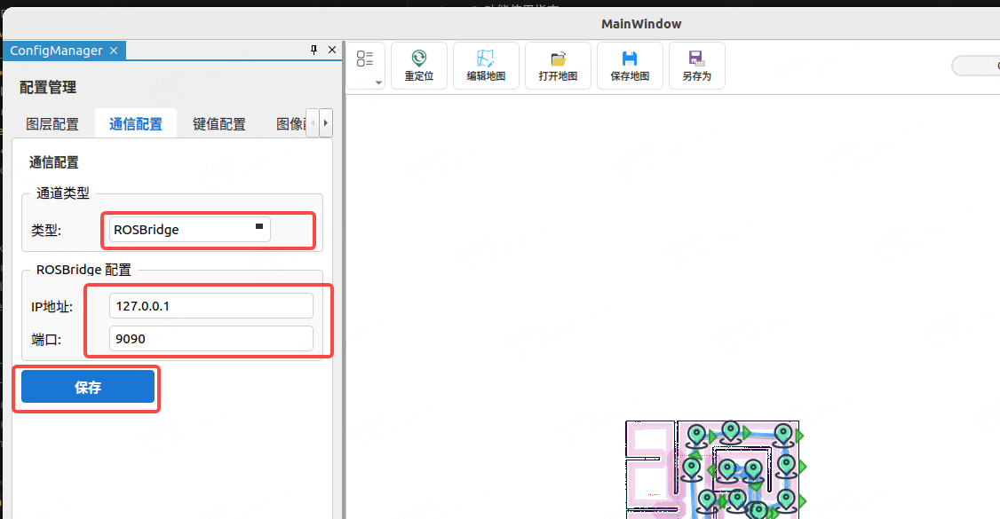

# 功能使用指南

## 通信 Channel 配置

默认情况下，系统会根据当前使用的 ROS1 或 ROS2 自动打开相应的通信通道。本节介绍如何配置和使用 rosbridge 通道。

### 启动 rosbridge 服务

在机器人端运行 rosbridge 服务：

**ROS2（推荐）：**
```bash
ros2 run rosbridge_server rosbridge_websocket
```
或使用 launch 文件：
```bash
ros2 launch rosbridge_server rosbridge_websocket_launch.xml
```

**ROS1：**
```bash
roslaunch rosbridge_server rosbridge_websocket.launch
```

### 配置界面切换

在软件界面中切换到 rosbridge 通道：



**注意事项：**
- 切换完成后需要重启软件才能生效
- 请确保正确填写机器人 rosbridge 的 IP 地址和端口
- 目前大地图无法通过 rosbridge 传输，需要手动使用软件的"打开地图"功能加载地图文件


## 地图显示与编辑

### 地图显示
软件支持显示全局地图和局部地图，地图数据来自 ROS 话题。

要启用地图显示，请确保 `config.json` 中有以下配置：
```json
{
  "topics": {
    "map": {
      "display_name": "Map",
      "topic": "/map",
      "enable": true
    }
  }
}
```

### 地图编辑

软件提供丰富的地图编辑功能：


#### 拓扑地图

支持通过拖拽方式设置机器人导航目标点。

**拓扑地图消息定义：** [topology_msgs](https://github.com/chengyangkj/topology_msgs)

**功能说明：**

- **保存地图：** 拓扑地图编辑完成后，点击保存地图按钮，软件会将地图保存为 `*.topology` 格式的 JSON 文件。同时会发布 `/map/topology/update` 话题，更新最新的拓扑地图，用户可订阅此话题实现自定义保存逻辑。

- **地图加载：** 软件会自动订阅 `/map/topology` 话题。如果话题没有数据，则会读取相对路径存储的默认地图文件。


**配置要求：** 如果导航点发布无响应，请检查以下配置：
```json
{
  "move_base_simple": {
    "display_name": "NavGoal",
    "topic": "/move_base_simple/goal",
    "enable": true
  }
}
```

#### 橡皮擦工具

点击橡皮擦工具可以擦除地图中的障碍物：


#### 画笔工具

使用画笔工具在地图上绘制障碍物：


#### 线段绘制

在地图上绘制直线段：


#### 地图保存

编辑完成后，点击保存按钮保存地图文件：

- `*.pgm` - 地图图像数据
- `*.yaml` - 地图描述文件
- `*.topology` - 拓扑数据（导航点信息）


## 机器人控制

### 手动控制

使用键盘或界面按钮控制机器人移动：


**配置要求：** 请确保在 `config.json` 中正确配置手动控制话题：
```json
{
  "velocity": {
    "display_name": "Speed",
    "topic": "/cmd_vel",
    "enable": true
  }
}
```

### 机器人重定位

在地图上设置机器人的初始位置和朝向：
- **左键拖动：** 设置机器人位置
- **右键旋转：** 调整机器人朝向


**配置要求：** 确保在 `config.json` 中正确配置：
```json
{
  "initialpose": {
    "display_name": "Reloc",
    "topic": "/initialpose",
    "enable": true
  }
}
```

### 速度仪表盘

实时显示机器人的线速度和角速度：


**配置要求：** 需要在 `config.json` 中配置里程计话题：
```json
{
  "odom": {
    "display_name": "Odometry",
    "topic": "/odom",
    "enable": true
  }
}
```

### 电池显示

实时显示机器人的电池状态信息：


**配置要求：** 需要发布 `sensor_msgs::BatteryState` 类型的消息，在 `config.json` 中配置：
```json
{
  "battery": {
    "display_name": "Battery",
    "topic": "/battery",
    "enable": true
  }
}
```

## 导航功能

### 多点导航

支持设置多个导航点，按指定顺序依次执行导航任务：


**使用步骤：**
1. 在地图上添加导航点
2. 设置导航点的执行顺序
3. 点击"开始任务"按钮启动导航
4. 实时监控任务执行进度

## 相机显示

支持多路相机图像实时显示：

- RGB 彩色图像和深度图像
- 支持压缩图像传输
- 功能移植自 rqt_image_view

**配置示例：** 在 `config.json` 中配置相机话题：
```json
{
  "images": [
    {
      "location": "front",
      "topic": "/camera/rgb/image_raw",
      "enable": true
    },
    {
      "location": "front/depth",
      "topic": "/camera/depth/image_raw",
      "enable": true
    }
  ]
}
```

## 机器人车身显示

支持在地图上显示机器人车身轮廓，支持多种形状：

- 矩形
- 圆形（椭圆）
- 自定义多边形

**配置示例：** 在 `config.json` 中配置机器人车身形状：
```json
{
  "robot_shape_config": {
    "shaped_points": [
      {"x": 0.5, "y": 0.5},
      {"x": 0.5, "y": -0.5},
      {"x": -0.5, "y": -0.5},
      {"x": -0.5, "y": 0.5}
    ],
    "is_ellipse": false,
    "color": "0x00000FF",
    "opacity": 0.5
  }
}
``` 